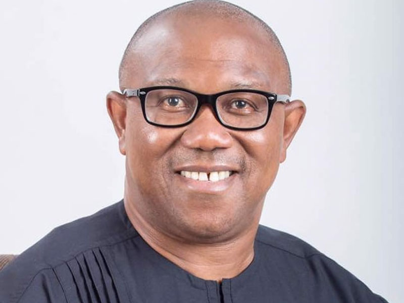
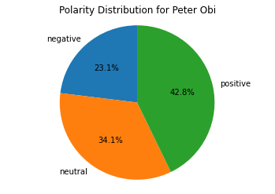
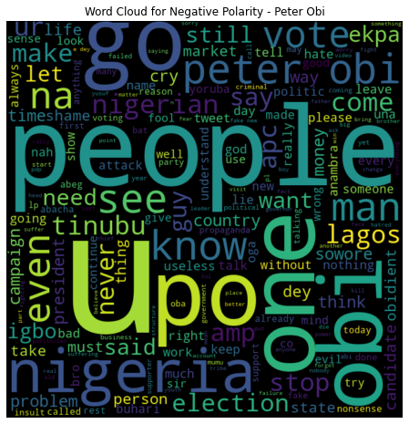
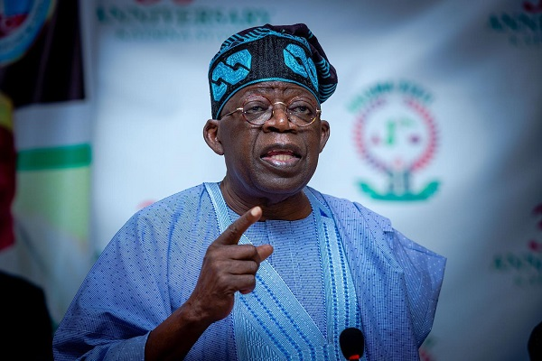
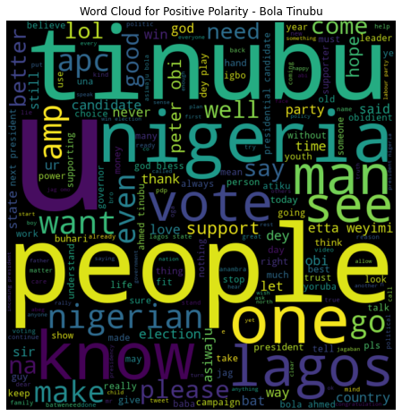
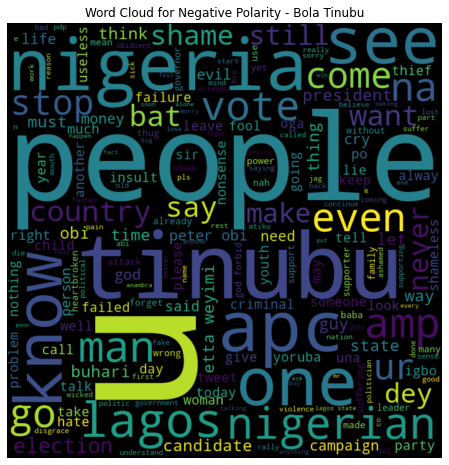
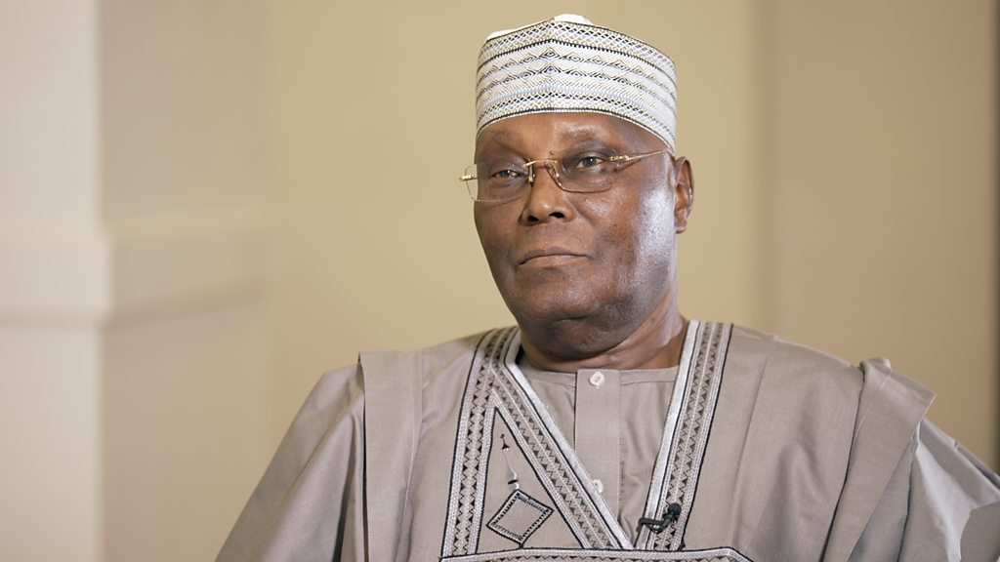
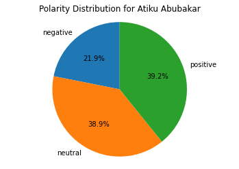
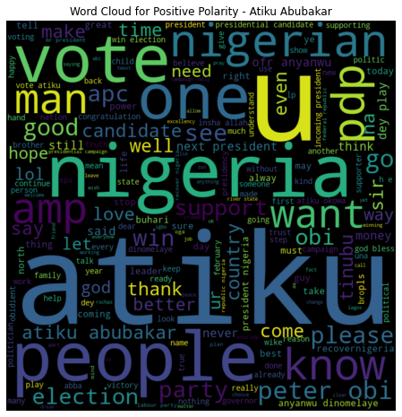
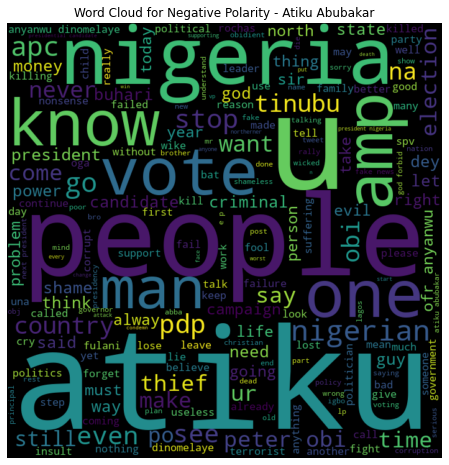

# Sentiment Analysis on Twitter Data Regarding Nigeria 2023 Presidential Elections

This project aims to conduct exploratory analysis and sentiment analysis, utilizing the VADER Approach, on a  dataset extracted from Twitter API.

## Introduction

The 2023 presidential elections will exert a profound influence on the political landscape of Nigeria. The leading Presidential candidates are Peter Obi, Bola Tinubu and Atiku Abubakar. Accurately gauging public sentiment toward the political candidates is crucial for effectively measuring public opinion. In this project, a comprehensive analysis of Twitter data was undertaken to extract valuable insights and uncover hidden patterns that can provide political candidates with actionable knowledge that can significantly enhance their prospects of winning the election.

**_Disclaimer_**: _This project is exclusively intended to demonstrate my analytical skills and does not endorse any political affiliations or aspirations. Furthermore, utmost regard for the privacy of users has been observed_
.

## Problem Statement
1. What is the overall sentiment of Twitter users towards the political candidates?
2. What significant trends and insights can be used by the political candidates?
3. Who has the overall best impression on Twitter?
4. What were the most associated positive and negative keywords associated with each presidential candidate?

## Skills Demonstrated 

This project involved the integration of various skills:
- Data collection
- Data Preprocessing
- Sentiment Analysis
- Natural Language Processing (NLP) techniques using Python Programming language, 
- Visualization
- Generation of meaningful interpretations and insights.

## About Data
A total collection of 150,000 tweets dating from January 31st and February 15th,2023  were obtained through the Twitter API using Python Open source library, snscrape. These tweets were extracted by utilizing search queries corresponding to the official Twitter handles of the prominent presidential candidates, namely @PeterObi, @Atiku, and @OfficialAbat. For avoidance of bias, 50,000 tweets were mined from each handles. The data contains 11 columns and the description is given below. 

Variable Names  |  Description
:--------------:|:---------------------------------------------------:
Unnamed         | n/a
Date            | The date the tweet was created
Tweet URL       |  Unique URL or web address of a particular tweet
User            |  Twitter handle that made the tweet post
Source          |  Application or platform used in posting the tweets
Tweet           |  message or post that was shared
Like_counts     |  The number of times a particular tweet was liked
Retweet_count   |  The number of times a particular tweet was retweeted
Quote_count     |  The number of times a particular tweet was quoted
Reply_count     |  The number of times a particular tweet received replies

## Steps of the project

The steps of this project consists of the following sections:

1. Data Collection
2. Importing and Reading the datasets.
3. Data Exploration
4. Visualization
5. Feature Engineering
6. Text Preprocessing
7. Sentiment Analysis

## Summary of  Implmentation

Data was extracted from Twitter API using the python library, snscrape, and exploratory data analysis was  carried out on the data to identify hidden trends and patterns. The tweets will be pre-processed by removing irrelevant data to make it suitable for sentiment analysis.
Sentiment analysis task will be conducted on the pre-processed tweets utilising Natural Language Processing (NLP) libraries, VADER  to classify the tweets as positive, negative, or neutral. The results will be presented through charts and Word clouds to facilitate comprehension and communication of the findings.

This project contains 3 python notebooks which are: 

**[Data Extraction](https://github.com/ObaroJoseph/Sentiment-Analysis/blob/main/Data%20Extraction.ipynb)** contains how the data was extracted from Twitter API

**[Data analysis](https://github.com/ObaroJoseph/Sentiment-Analysis/blob/main/Data%20analysis.ipynb)** which contains Data Exploration, Visualizations and Observations.

**[Sentiment Analysis](https://github.com/ObaroJoseph/Sentiment-Analysis/blob/main/Sentiment%20Analysis.ipynb)** which contains Feature Engineering, Text Preprocessing and Sentiment Analysis implementation. 

## Results and Visualization

### - Peter Obi

 
 
 
 
 Positive Sentiment Word Cloud             |    Negative Sentiment Word Cloud
:-----------------------------------------:|:----------------------------------------------: 
     |                

### - Bola Tinubu

 
 Positive Sentiment Word Cloud              |    Negative Sentiment Word Cloud
:------------------------------------------:|:----------------------------------------------: 
    |                

### Atiku Abubarkar

 Positive Sentiment Word Cloud                 |    Negative Sentiment Word Cloud
:---------------------------------------------:|:----------------------------------------------: 
    |    
   
   
 ## Findings and Conclusion. 
 
1. Tweets associated with Peter Obi had the highest positive polarity score, indicating a relatively more positive sentiment towards him. However, his neutral  
   polarity score was the lowest, suggesting a lack of neutrality in the sentiment. Atiku Abubakar had the highest neutral polarity score, indicating a relatively    more neutral sentiment, and his negative polarity score was the lowest, suggesting a lower negative sentiment. Bola Tinubu received the highest negative       
   polarity scores, indicating a relatively higher negative sentiment towards him, while his positive polarity score was the least among the candidates, 
   suggesting a lower positive sentiment.
   
2. An exploratory analysis of tweets revealed that the majority of tweets (68.32%) were generated from Android phones, followed by iPhones (25.79%). Atiku   
   Abubakar had the highest number of users tweeting from Android devices, while Bola Tinubu and Peter Obi had a more balanced usage of both Android and iPhone 
   devices among their supporters.

   Peak engagement for Peter Obi's tweets occurred at 09:00 and 18:00, for Bola Tinubu at 09:00 and 20:00, and for Atiku Abubakar at 09:00 and 13:00.

   Despite posting on only 3 out of 16 days, Peter Obi had the highest tweet engagement per day, indicating substantial engagement during those limited days. Bola    Tinubu posted tweets on 7 out of 16 days, maintaining a consistent presence with relatively lower engagement than Peter Obi but higher than Atiku Abubakar.

   Atiku Abubakar demonstrated consistent Twitter presence by tweeting every day, but his engagement count remained lower compared to Peter Obi and Bola Tinubu,      suggesting his core supporters may not be as active or vocal on the platform..
   
   
  3. Peter Obi's tweets received the highest number of likes and retweets, indicating popularity and resonance among the Twitter community. Atiku Abubakar's   
     tweets generated more quotes and replies, sparking discussions and direct responses. Bola Tinubu's tweets had the lowest engagement, suggesting lower 
     attention or interest, potentially due to various factors such as tweet content or campaign strategy. 
     
  4. Based on sentiment analysis, positive tweets about Peter Obi mention words such as "support," "bless," and "best," indicating strong support from his   
     followers. Negative tweets mention "Igbo," "stop," and "problem," suggesting concerns about his Igbo ethnicity potentially posing challenges. Bola Tinubu  
     receives positive tweets mentioning "Lagos," "hope," and "support," likely highlighting his previous role as governor of Lagos State. Negative sentiment 
     tweets include terms like "failed," "evil," and "nothing," reflecting how his opponents perceive him. As for Atiku Abubakar, positive tweets mention "vote" 
     and "love," while negative sentiment tweets include terms like "problem" and "thief."
  
   
   In conclusion, using sentiment analysis on twitter data regarding the 2023 presidential election has yielded significant insights into public opinions towards 
   the presidential candidates. 
   
   
   
   
   
   
   
   
   
   
   
   
   
   
   
   
   
   

